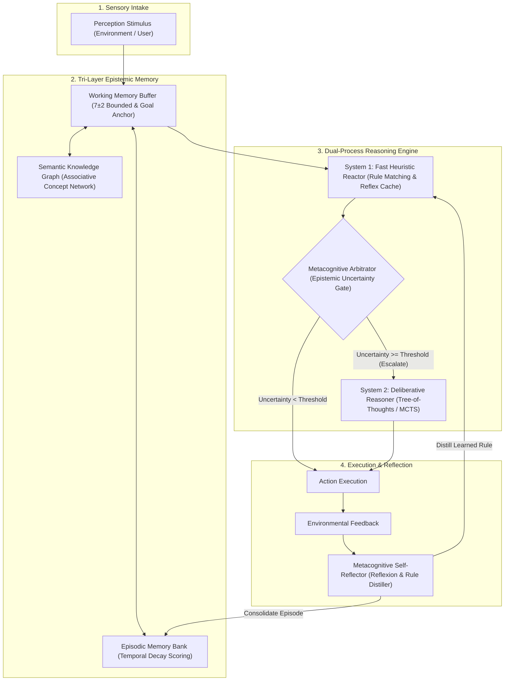

# CogniMesh: Dual-Process Cognitive Architecture & Diagnostic Research Sandbox

<p align="center">
  
  
  
  
  
</p>

---

## 🔬 Executive Overview

**CogniMesh** is an open-source, modular research framework, diagnostic benchmark suite, and interactive visual laboratory for studying **autonomous agent cognition, epistemic memory consolidation, deliberative planning, and dialectical multi-agent consensus**.

While conventional LLM agent frameworks (such as LangChain, AutoGen, and CrewAI) primarily operate as prompt routers, they suffer from fundamental failure modes:
1. **Cognitive Myopia**: Inability to arbitrate between fast reactive heuristics and deliberative multi-step search.
2. **Retrieval Pollution & Epistemic Decay**: Unweighted vector lookup causes hallucination and memory interference over long conversation horizons.
3. **Multi-Agent Sycophancy**: Agents in consensus debates rapidly collapse into premature conformity, abandoning grounded counter-arguments.
4. **Diagnostic Opacity**: Lack of granular telemetry into intermediate internal reasoning states.

**CogniMesh** addresses these limitations by introducing a formal **dual-process cognitive architecture (Kahneman System 1 / System 2)**, a **tri-layer epistemic memory system**, a **metacognitive self-reflection loop**, and a **5-task diagnostic benchmark suite**.

---

## 🏛️ Cognitive Architecture



---

## 🌟 Key Features

### 1. Dual-Process Cognitive Engine (Kahneman System 1 / System 2)
- **System 1 (Heuristic Reactor)**: Low-latency (~0.1ms) rule-based reflexes and associative action cache for routine tasks.
- **System 2 (Deliberative Engine)**: Tree-of-Thoughts (ToT) exploration with intermediate heuristic evaluation, forward simulation, and self-corrective trajectory pruning.
- **Epistemic Uncertainty Gating**: Automatically computes epistemic uncertainty ($U = (1 - C_{\text{heuristic}}) \cdot \alpha + \text{Novelty} \cdot \beta$) to arbitrate between System 1 reflex and System 2 deliberation.

### 2. Tri-Layer Epistemic Memory
- **Working Memory Buffer**: Strictly capacity-bounded (Miller's $7 \pm 2$ limit) with dynamic attentional salience and persistent Central Executive goal anchoring.
- **Episodic Memory Bank**: Time-indexed interaction log with exponential temporal decay:
  $$\text{Score}(e, q, t) = w_r \cdot e^{-\lambda \Delta t} + w_i \cdot \text{Salience}(e) + w_s \cdot \text{Relevance}(q, e)$$
- **Semantic Knowledge Graph**: Associative network representing concepts, categories, and relational edges with spreading activation ($A_j = \sum_i A_i \cdot w_{ij}$).

### 3. Metacognitive Self-Reflection (Reflexion Loop)
- Analyzes environment feedback post-execution.
- Detects cognitive drift, generates counterfactual alternatives (*"What should have been executed instead?"*), and synthesizes new defensive rules to consolidate directly into System 1.

### 4. Dialectical Multi-Agent Consensus Arena
- Formal **Thesis-Antithesis-Synthesis** multi-turn debates between specialized cognitive agents:
  - **Agent-Alpha (Proposer)**: Formulates the initial thesis.
  - **Agent-Beta (Adversary)**: Actively identifies counter-arguments and failure boundaries.
  - **Agent-Gamma (FactChecker)**: Empirically verifies assertions against knowledge memory.
  - **Agent-Omega (Synthesizer)**: Resolves contradictions into Hegelian synthesis.
- Telemetry monitors **Dialectical Entropy** and the **Sycophancy Susceptibility Index**.

### 5. Standardized Diagnostic Benchmark Suite
A 5-dimensional diagnostic battery to stress-test cognitive capabilities:
| Task Dimension | Category | Metric Tested | Default Score |
|:---------------|:---------|:--------------|:-------------:|
| **Needle in a Memory Stream** | Memory Fidelity | Deep episodic recall amidst noise distractors | **100.0%** |
| **Counterfactual Error Recovery** | Metacognition | Failure detection & defensive rule synthesis | **100.0%** |
| **Sycophancy Resistance** | Multi-Agent Alignment | Peer pressure resistance in dialectical debate | **77.4%** |
| **Tool Degradation & Noise** | Operational Robustness | Safe handling & escalation on corrupted inputs | **95.0%** |
| **Cognitive Drift & Goal Retention** | Long-Horizon Planning | Goal preservation across sequential cycles | **100.0%** |
| **Composite Diagnostic Index** | Overall Benchmark | Weighted harmonic performance average | **94.4%** |

### 6. Interactive Visual Research Laboratory
- **Zero-dependency Web UI**: Built with pure HTML5, CSS3 glassmorphism, and dynamic HTML5 Canvas visualizers.
- **Cognitive Loop Telemetry**: Real-time visualization of working memory buffers, System 1/2 arbitration progress bars, and reflection post-mortems.
- **Force-Directed Knowledge Graph**: Interactive physics-based canvas visualizing concept nodes, relational links, and spreading activation waves.
- **Multi-Agent Arena Terminal**: Real-time transcript of dialectical debate with stance tracking.
- **Interactive Radar Chart**: Live 5-axis capability radar chart.

---

## 🚀 Quickstart

### Prerequisites
- Python 3.9+ (Core engine has **zero external package dependencies**!)

### Installation
Clone the repository:
```bash
git clone https://github.com/msadmanarian/Agent-Research.git
cd Agent-Research
```

### CLI Usage

#### 1. Interactive Cognitive Cycle Demo
Run an end-to-end demonstration showing System 1 reflex, System 2 escalation, and rule consolidation:
```bash
python run.py --demo
```

#### 2. Run Diagnostic Benchmark Battery
Execute all 5 diagnostic benchmark stress-tests:
```bash
python run.py --benchmark
```

#### 3. Convene Multi-Agent Dialectical Debate
Run a multi-turn debate on autonomous agent paradigms:
```bash
python run.py --debate
# Or specify a custom topic:
python run.py --debate --topic "Symbolic Reasoning vs Continuous Latent Representations"
```

#### 4. Launch Interactive Web Laboratory
Start the visual research workbench on `http://localhost:8080`:
```bash
python run.py --serve --port 8080
```
Open your browser and navigate to `http://localhost:8080` to interact with the live dashboard!

---

## 🧪 Running Unit & Integration Tests

CogniMesh comes with an exhaustive test suite covering all cognitive modules, memory layers, consensus metrics, and REST endpoints:

```bash
python -m unittest discover -s tests -p "test_*.py" -v
```
All 27 unit and integration tests execute in under 1 second.

---

## 📂 Repository Structure

```text
Agent-Research/
├── README.md                           # Master documentation
├── LICENSE                             # MIT License
├── pyproject.toml                      # Packaging configuration
├── requirements.txt                    # Optional dependencies specification
├── run.py                              # Unified CLI launcher
├── docs/
│   ├── PAPER.md                        # Academic research white paper
│   ├── ARCHITECTURE.md                 # In-depth architectural specification
│   └── BENCHMARKS.md                   # Diagnostic protocol & scoring models
├── agent_research/
│   ├── __init__.py                     # Package entry point
│   ├── cli.py                          # Unified CLI implementation
│   ├── core/
│   │   ├── types.py                    # Strong typing & dataclasses
│   │   ├── system1.py                  # System 1 Fast Heuristic Reactor
│   │   ├── system2.py                  # System 2 Deliberative Reasoner (ToT)
│   │   └── engine.py                   # Central Cognitive Loop Orchestrator
│   ├── memory/
│   │   ├── working_memory.py           # Capacity-bounded buffer (Miller's 7±2)
│   │   ├── episodic_memory.py          # Temporal decay experiential store
│   │   └── semantic_graph.py           # Associative knowledge network
│   ├── metacognition/
│   │   ├── uncertainty_evaluator.py    # Epistemic uncertainty arbitrator
│   │   └── self_reflection.py          # Reflexion & counterfactual reasoning
│   ├── multiagent/
│   │   ├── debate_arena.py             # Dialectical debate engine
│   │   └── consensus_metrics.py        # Entropy & sycophancy metrics
│   ├── benchmarks/
│   │   ├── harness.py                  # Benchmark harness & aggregator
│   │   └── tasks/                      # 5 Diagnostic stress tests
│   ├── llm/
│   │   ├── base.py                     # Provider abstraction
│   │   ├── mock_engine.py              # Zero-cost deterministic simulator
│   │   └── real_providers.py           # OpenAI / Ollama adapters
│   └── web/
│       ├── server.py                   # Zero-dependency HTTP & REST server
│       └── static/                     # HTML5, CSS3 & Canvas dashboard
└── tests/                              # Unit & integration test suite
```

---

## 📖 Theoretical Documentation

For comprehensive theoretical derivations and mathematical formulations, please refer to:
- **[Research White Paper (docs/PAPER.md)](docs/PAPER.md)**: Formal academic paper covering dual-process cognition, memory decay equations, and sycophancy theorems.
- **[Architecture Deep-Dive (docs/ARCHITECTURE.md)](docs/ARCHITECTURE.md)**: State machine specifications, class hierarchies, and extensibility patterns.
- **[Benchmark Protocol (docs/BENCHMARKS.md)](docs/BENCHMARKS.md)**: Diagnostic metrics, scoring formulas, and ablation experiments.

---

## 📜 BibTeX Citation

If you utilize CogniMesh in your research, academic projects, or benchmarks, please cite:

```bibtex
@software{arian2026cognimesh,
  author = {Arian, Sadman},
  title = {CogniMesh: Dual-Process Cognitive Architecture & Diagnostic Research Sandbox for Autonomous Agents},
  year = {2026},
  publisher = {GitHub},
  journal = {GitHub repository},
  howpublished = {\url{https://github.com/msadmanarian/Agent-Research}}
}
```

---

## 📄 License

This project is licensed under the **MIT License** — see the [LICENSE](LICENSE) file for details.
